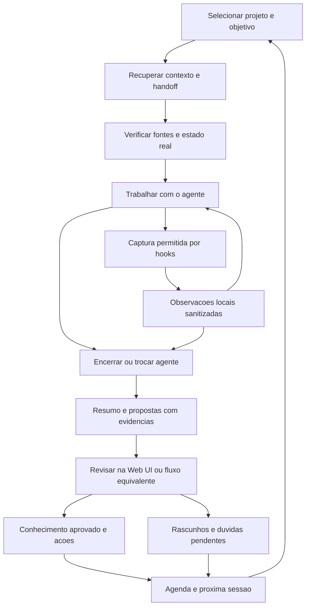

# Fluxos de uso

## Ciclo completo

## Entrada manual e reuniao

1. Usuario cola notas/trechos ou fornece transcricao e imagens.
2. Informa titulo, data, fonte e projeto quando conhecidos; campos ausentes permanecem ausentes.
3. Aplicacao preserva original e anexos dentro do limite permitido.
4. IA propoe resumo, assuntos, pessoas, vinculos, decisoes, acoes e perguntas.
5. Cada proposta aponta para trecho, marcador temporal ou imagem. Se nao houver marcadores, usar localizador de trecho, sem inventar horario.
6. Usuario aceita, edita, rejeita ou deixa para depois cada proposta; pode aprovar um conjunto apos inspeciona-lo.
7. Registros aprovados aparecem nos projetos/produtos e no acompanhamento. Rascunhos permanecem visiveis como pendentes.

Separar 'seria bom investigar' de 'eu investigarei'. Separar decisao tomada de alternativa discutida. Uma anotacao pode alimentar varios assuntos sem duplicar seu original.

## Imagens

Guardar original, identificador, nome seguro e vinculo com a entrada. Permitir descricao manual. OCR/interpretacao sao derivados revisaveis. Avisar quando a imagem nao pode ser lida ou o resultado e incerto. Nao apresentar leitura parcial como completa.

## Produtos, projetos e refinamentos

- Produto: contexto relativamente duradouro, regras e conhecimento tecnico.
- Projeto: iniciativa com objetivo, escopo, entregas e riscos; pode afetar varios produtos.
- Refinamento: problema, comportamento esperado, criterios, cenarios, decisoes e lacunas; pode existir sem projeto formal.
- Uma reuniao pode propor atualizacoes nos tres niveis, todas ligadas a mesma fonte.
- Atualizacao que substitui conhecimento vigente preserva historico e motivo. Conflitos vao para revisao.

## Agenda do dia

A agenda e uma visao dos registros de acao, nao uma segunda lista independente. Mostra 'Hoje', 'Aguardando' e 'A confirmar'. Prazo e dia planejado sao campos distintos.

Regra inicial recomendada:

1. Prioridade fixada manualmente pelo usuario.
2. Prazos explicitos vencidos ou para hoje.
3. Acoes que desbloqueiam entregas registradas.
4. Impacto explicitamente informado.
5. Demais acoes executaveis, com desempate estavel por data de criacao.

Mostrar o motivo da ordenacao. Uma acao bloqueada aparece com seu bloqueio e nao como imediatamente executavel. Itens aguardando terceiros podem ter uma acao propria de acompanhamento. Concluir uma acao local nao conclui automaticamente um item no Jira.

## Obsidian

Usuario escreve e pesquisa no vault. Aplicacao detecta mudancas e atualiza a busca. Notas sem propriedades entram como notas livres e podem receber propostas de classificacao; nunca recebem alteracao silenciosa em massa.

Propostas guardam a versao de origem. Se a nota mudar antes da aplicacao, mostrar conflito e recalcular/comparar antes de gravar. Preservar corpo, links e propriedades desconhecidas.

## Inicio e troca de agente

1. Escolher escopo e objetivo; recuperar pequeno conjunto de fontes relevantes.
2. Listar handoffs elegiveis. Nao consumir automaticamente todos os handoffs do projeto.
3. Selecionar handoff; verificar repositorio/branch/commit e alteracoes locais quando aplicavel.
4. Agente declara divergencias e limites antes de continuar.
5. Encerrar com resumo, evidencias, pendencias e proximo passo.

Se hooks estiverem indisponiveis, usar comandos explicitos de inicio, checkpoint e encerramento. Os nomes concretos dos comandos ainda serao definidos.

## Falhas e interrupcoes

- IA indisponivel: manter entrada e permitir organizacao manual; mostrar analise pendente.
- Hook indisponivel: trabalho continua; captura indica falha ou lacuna.
- Sessao sem encerramento: status interrompida/a confirmar; reconstruir apenas com eventos existentes.
- Reentrega: nao duplicar observacao nem efeitos de consolidacao.
- Material nao revisado: nao apresentar como conhecimento aprovado.
- Contexto ausente: declarar lacuna e solicitar esclarecimento, sem completar por suposicao.
